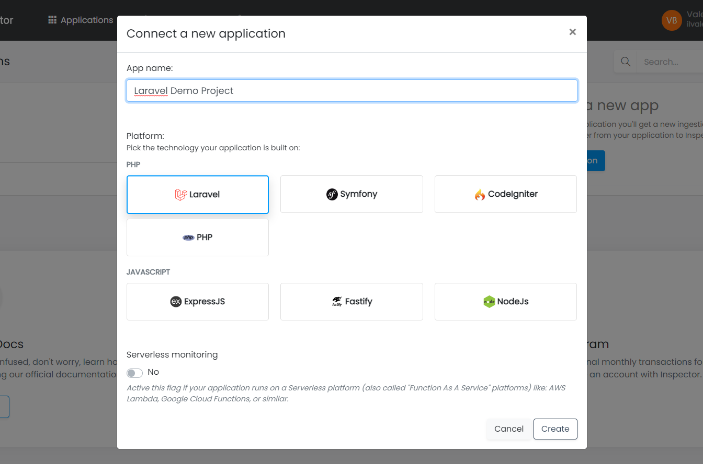

# Laravel Demo Project
This repository contains a standard Laravel application with the commands to test how Inspector 
is able to monitor all the application's internal processes.

## Requirements
It ships with a ready-to-use Homestead virtual machine that contains all the necessary components to make
the application work (PHP, nginx, Redis, MySQL, etc.)

So you must have installed virtual-box and vagrant in your PC:

- Download and install VirtualBox from here: https://www.virtualbox.org/wiki/Downloads
- Download and install Vagrant from here: https://www.vagrantup.com/downloads.html

## Checkout and Run
First checkout this repository in a directory on your local machine.

Access the project's directory in your terminal and run the Homestead Vagrant machine:

```shell
vagrant up
```

Move the prompt into the code directory:

```shell
cd code
```

Now you are in the project folder inside the Vagrant virtual machine so you can start the queue worker:

```shell
php artisan queue:work
```

## 2 - Connect with Inspector
Access to your [Inspector account](https://app.inspector.dev) or [Sign-Up](https://app.inspector.dev/register) 
for a new one.

Once inside the dashboard click on the "New Application" button to create a new application:



You will be redirected to the installation instructions. This application have the package installed yet, so you just have 
to copy the ingestion key and paste it in your application .env file.

```dotenv
INSPECTOR_INGESTION_KEY=xxxxxxxxxxxxxxxxxxxxxxxxxxxxxx
```

## How to use the demo project
